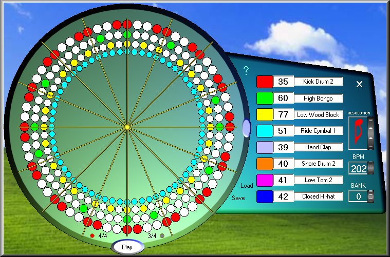



## Virtual Drum

### Description

Virtual Drum uses a circular interface to make drum patterns.
 
### More Info
 

             |
---                |---
**Submitted On**   |2005-10-11 18:39:40
**By**             |[Agustin Rodriguez](https://github.com/Planet-Source-Code/PSCIndex/blob/master/ByAuthor/agustin-rodriguez.md)
**Level**          |Intermediate
**User Rating**    |5.0 (75 globes from 15 users)
**Compatibility**  |VB 6\.0
**Category**       |[Complete Applications](https://github.com/Planet-Source-Code/PSCIndex/blob/master/ByCategory/complete-applications__1-27.md)
**World**          |[Visual Basic](https://github.com/Planet-Source-Code/PSCIndex/blob/master/ByWorld/visual-basic.md)
**Archive File**   |[Virtual\_Dr19395110112005\.zip](https://github.com/Planet-Source-Code/agustin-rodriguez-virtual-drum__1-62855/archive/master.zip)

